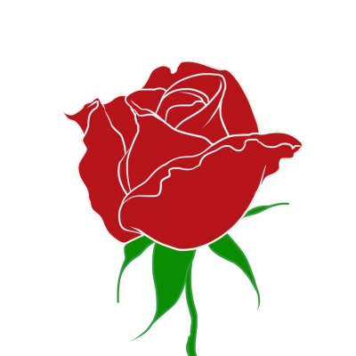

    SICE Annual Conference Poster Presentation Award is canceled since SICE2020 will be held online

# {{ page.title }}

### Description
To recognize excellent presenters who submit high quality papers and present them at the SICE Annual Conference.

### Award
Winner of each category: Certificate and trophy

### Categories

1. SICE Annual Conference International Award (no restriction on age, Sub Category: Basic technology/Application)
2. SICE Annual Conference Young Author’s Award (under 35 years of age)
3. <del>SICE Annual Conference Poster Presentation Award (no restriction on age)</del> 

### Winners and Finalists of SICE Annual Conference International Award 

{:.DocTable}
| Winner | Subcategory | Paper number | Schedule code | Nominee         | Affiliation                                       | Title                                                                                                                                    |
|----|--------------|---------------|-----------------|---------------------------------------------------|------------------------------------------------------------------------------------------------------------------------------------------|
||**Application Award**| **121**          | **ThL3P.1**      | **Koike, Masakazu** | **Tokyo University of Marine Science and Technology** | **Monotonicity Analysis for Optimal Scheduling of Storage Batteries and Power Generators**  **- Considering Ramp Limit of Thermal Power Plant -** |
||| 176          | FrBT17.4      | Li, Jiarui      | Kyoto University                                  | Data Dimensionality Reduction by Introducing Structural Equation Modeling to Machine Learning Problems                                   |
||| 201          | SaBT19.5      | Kikuchi, Hiroya | Hiroshima University                              | Robust Nash Strategy for Uncertain SIR Time-Delay Model                                                                                  |
||**Basic Technology Award**| **270**          | **SaAT20.1**      | **Chen, Weiya**     | **Kyoto University**                                  | **Driver's Mental Workload Measurement Concerning Cognitive Channels**                                                                       |
||| 428          | SaAT18.7      | Yamauchi, Junya | The University of Tokyo                           | Visual Pursuit Control with Target Motion Learning Via Gaussian Process                                                                  |
||| 492          | FrAT19.4      | Itami, Teturo   | Robotics Industry Development Council             | Measuring Weighting Factor of Eigenstates in Quantum Superposition by Classical Mechanical 'quantum' Computer                            |

### Winner and Finalists of SICE Annual Conference Young Author’s Award 

{:.DocTable}
| Winner | Paper number | Schedule code | Nominee         | Affiliation                                       | Title                                                                                                                                                   |
|----|--------------|---------------|-----------------|---------------------------------------------------|---------------------------------------------------------------------------------------------------------------------------------------------------------|
|| **166**          | **SaAT18.5**      | **Sasaki, Yasuo**   | **Nagoya University**              | **Design of Observers for the Flow around a Cylinder using Machine Learning Techniques**                                                                    |
|| 189          | FrAT20.1      | Niwa, Takahiro  | Toyota Central R&D Labs., Inc  | Bio-Inspired Cooperative Control Using a Nonlinear Oscillator without Direct Communication among Agents                                                 |
|| 191          | FrAT16.5      | Tamba, Masaaki  | Kyushu Institute of Technology | Renewable Implementation of Rational Biomolecular Systems Design                                                                                        |
|| 312          | FrAT16.3      | Deguchi, Hideki | Toyota Central R&D Labs        | Active Visual Localization Using Predicted Images                                                                                                       |
|| 524          | SaBT16.6      | Tagawa, Yusaku  | The University of Tokyo        | Experimental Study of Estimation of Coefficient of Static Friction with One-Axis Force Sensor by Observing Peripheral Local Slips on Elastic Hemisphere |

### Application Method:

1. **SICE Annual Conference International Award (IA)**  
All of the regular papers are evaluated as a candidate of IA without explicit application, while the position papers are excluded.
The presenter of each regular paper should be identified on its final submission, otherwise it is excluded from the candidates of IA.

2. **SICE Annual Conference Young Author’s Award (YAA)**  
Any eligible author of both of the regular and position papers can apply for YAA.
An applicant should fill out the [Application Form for SICE Annual Conference Young Author’s Award]() and apply for the award at the final paper submission via [Papercept](https://controls.papercept.net/conferences/scripts/start.pl#SICE20) (deadline: <del>Monday, July 20, 2020</del> **Saturday, August 1, 2020**).
**Please click “Submit a contribution to SICE 2020” in aforementioned URL**.
It should be noted that any regular paper applied to YAA is excluded from the candidates of IA. 

3. <del>**SICE Annual Conference Poster Presentation Award (PA)** </del> 
<del>Both of the regular and position papers presented at the poster sessions are evaluated as a candidate of PA without explicit application.</del> 

### Basis of Judgment

- Quality of the paper (originality, impact) and presentation technique.
- The Award Selection Committee will select no more than 6 finalists for International Award, no more than 5 finalists for Young Author’s Award, and no more than 10 finalists for Poster Presentation Award, based on the final manuscripts. Those finalists will be notified before the conference.
- Two IA winners, one YAA winner and one PA winner will be selected during the conference based on the presentations as well as the quality of the papers.

### Presentation

The winners will be announced on SICE 2020 website. The prize consists of a certificate and a trophy. All other finalists receive certifications.
All other finalists receive certifications.

**SICE Awards Committee**